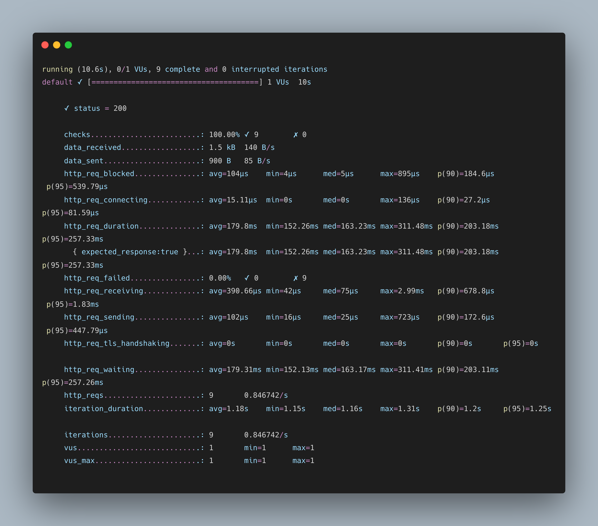
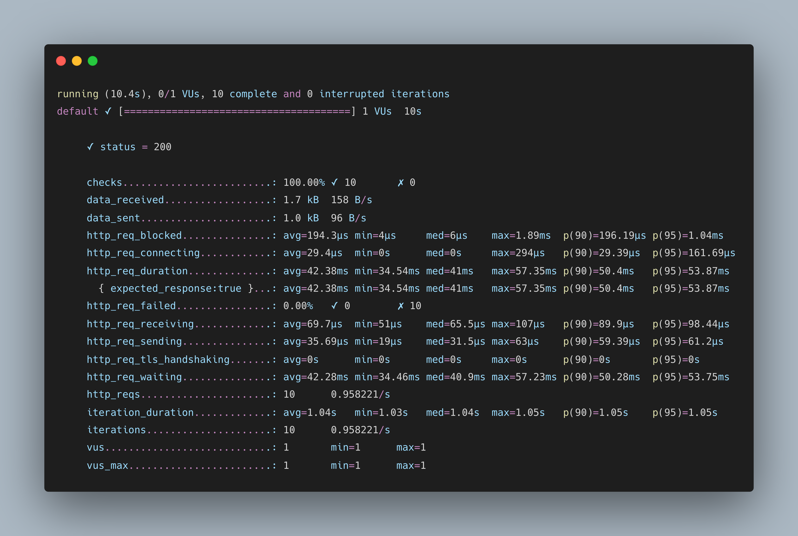
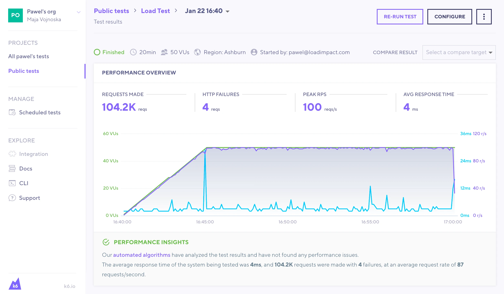

<div align="center">

# 使用 k6 对 .NET 进行性能测试

</div>

- [使用 k6 对 .NET 进行性能测试](#使用-k6-对-net-进行性能测试)
  - [什么是性能测试](#什么是性能测试)
    - [相关概念解释](#相关概念解释)
    - [常见性能测试工具](#常见性能测试工具)
  - [K6 介绍](#k6-介绍)
    - [常见性能测试类型](#常见性能测试类型)
    - [关键词解释](#关键词解释)
    - [环境搭建](#环境搭建)
    - [常用命令](#常用命令)
  - [示例展示](#示例展示)
    - [本地压测](#本地压测)
    - [集成 K6 Cloud](#集成-k6-cloud)
    - [集成 Azure Pipelines](#集成-azure-pipelines)
    - [结果可视化](#结果可视化)
  - [相关参考](#相关参考)

---

## 什么是性能测试

在软件开发中，性能测试是一种常见的测试实践，用于确定系统在特定工作负载下的响应能力和稳定性表现。它还用于排查，观察，验证系统在其他方面的质量。例如可扩展性，可靠性和资源使用情况。
性能测试是测试工程的一个子集，是一种计算机科学实践，致力于将性能指标构建在系统的设计,实现和架构中。

### 相关概念解释

|     | 释意                                                                                                                                                       |
| --- | ---------------------------------------------------------------------------------------------------------------------------------------------------------- |
| QPS | 每秒查询率 Queries Per Second。每秒的响应请求数，也即是最大吞吐能力，是衡量服务器性能端一个重要指标。                                                      |
| TPS | 每秒处理的事务数目 Transactions Per Second。每个 TPS 包含一个完整的请求流程（客户端请求服务端-> 服务端响应并处理【包含数据库访问】 -> 服务端返回给客户端） |
| RPS | 每秒吞吐率 Requests Per Second。指的是某个并发用户数下单位时间内处理的请求数。在不考虑事务的情况下可以近似与 TPS。                                         |

### 常见性能测试工具

> 由于我对其他测试框架不是很了解，这里只是简单的罗列，感兴趣的同学可以帮忙补充。关于这几种测试框架的对比，可以参考 Thoughtworks 的一篇洞见（文末有连接）：

- [JMitter](https://jmeter.apache.org/)
- [wrk](https://github.com/wg/wrk)
- [k6](https://github.com/grafana/k6)
- ...

## K6 介绍

**K6** 是一个基于 `Go` 语言实现的一个负载测试工具，其官网描述为: `The best developer experience for load testing`。具有如下关键特点：

- 提供对开发者友好的 CLI 工具
- 使用 JS/TS 进行脚本编写，支持本地和远程模块
- 提供 `Check` 和 `Thresholds` 功能，以目标为导向，友好的自动化测试
- 支持多种 DevOps 平台和可视化平台

### 常见性能测试类型

维基百科罗列了多达 **8 种** 性能测试类型，感兴趣的小伙伴可以查看文末连接查看更多详细内容。这里结合 K6 主要介绍如下几种测试类型如下几种常见的测试类型：

|                | 释意                                                                                                                                                                                                                            |
| -------------- | ------------------------------------------------------------------------------------------------------------------------------------------------------------------------------------------------------------------------------- |
| Smoke testing  | 中文释意为 **冒烟测试**。是一种常规测试。通过配置最小负载来验证系统的完整性。其主要目的是：验证测试脚本是否有问题；验证系统在最小负载情况下是否出现异常。                                                                       |
| Load testing   | 中文释意为 **负载测试**。是一种重要的性能测试。主要关注根据并发用户数或每秒请求数评估系统的当前性能。其主要目的是：用于确定系统在正常和峰值条件下的行为，确保当许多用户同时访问应用程序时，应用程序的性能能达到令人满意的程度。 |
| Stress testing | 中文释意为 **压力测试**。用于确定系统的性能瓶颈。其主要目的是：验证系统在极端条件下的稳定性和可靠性。                                                                                                                           |
| Soak testing   | 中文释意为 **浸泡测试**。其主要目的是：通过较长时间的性能测试来发现系统长时间处于压力之下而导致的性能和可靠性问题。                                                                                                             |

### 关键词解释

在 K6 中，通过一些参数配置可以模拟上述的测试场景。常见的参数如下所示：

|                    | 释意                                             |
| ------------------ | ------------------------------------------------ |
| vus                | 当前并发数(虚拟用户数)                           |
| vus_max            | 最大并发数(虚拟用户的最大数量)                   |
| rps                | 每秒并发请求数                                   |
| duration           | 持续运行时间                                     |
| checks             | 断言成功率                                       |
| data_sent          | 发送的数据量                                     |
| data_received      | 接收到的数据量                                   |
| iterations         | 测试中的 vu 执行 js 脚本（default 函数）的总次数 |
| iteration_duration | 完成默认/主函数的完整迭代所花费的时间            |

### 环境搭建

k6 支持 `Linux`,`Mac`,`Windows`,`Docker`方式来安装，安装方法也很简单，可以结合自己的实际环境，参考官网的安装方式进行本地环境安装：[Installation](https://k6.io/docs/getting-started/installation/)

### 常用命令

K6 提供两种方式进行压测场景的模拟，一种是 **CLI**，另一种就是通过 **JS** 脚本，这里先罗列一下常用的 **CLI** 命令:

```bash
k6 help [command] [flags]

# 将测试在 K6 的云端服务执行，需要提前注册 K6 账号并登录
k6 login [flags]
k6 cloud [flags]

# 检查脚本
k6 inspect [file] [flags]

# 执行 load test（本地）
k6 run [flags]

# 暂停测试
k6 pause [flags]

# 恢复测试
k6 resume [flags]

# 扩展测试
k6 scale [flags]

# 显示测试状态
k6 stats [flags]

# 显示版本
k6 version [flags]

# 模拟10个虚拟用户(VU)，连续压测30秒：
k6 run --vus 10 --duration 30s script.js
```

## 示例展示

### 本地压测

这里采用 .NET 6 中的 **MinimalAPI** 的方式构建了 2 个测试路由：

- GetWeatherForecastV1：使用 for 循环的方式并行构建 1_000_000 个对象
- GetWeatherForecastV2：使用 Parallel 并行构建 1_000_000 个对象

示例代码如下所示：

```csharp
const int maxLength = 1_000_000;

app.MapGet("/GetWeatherForecastV1",  () =>
{
    var forecast = new object[maxLength];
    for (var i = 0; i < forecast.Length; i++)
    {
        forecast[i] = new
        {
            Date = DateTime.Now.AddDays(i),
            temperatureC = Random.Shared.Next(-20, 55),
        };
    }
    return Results.Ok(forecast.Length);
}).WithName("GetWeatherForecastV1");

app.MapGet("/GetWeatherForecastV2", () =>
{
    var forecast = new object[maxLength];
    Parallel.For(0, maxLength, i =>
    {
        forecast[i] = new
        {
            Date = DateTime.Now.AddDays(i),
            temperatureC = Random.Shared.Next(-20, 55),
        };
    });

    return Results.Ok(forecast.Length);
}).WithName("GetWeatherForecastV2");
```

创建一个 JS 脚本，内容一下所示：

```javascript
import http from "k6/http";
import { check, sleep } from "k6";

export const options = {
  insecureSkipTLSVerify: true, // skip TLS verify
  noConnectionReuse: false, // disable keep-alive connections
  vus: 1, // 1 user looping for 10 seconds
  duration: "10s",
};

const BASE_URL = "http://localhost:5188";

export default () => {
  const resp = http.get(`${BASE_URL}/GetWeatherForecastV1`);
  check(resp, { "status = 200": resp.status === 200 });
  sleep(1); //S uspend VU execution for the specified duration.
};
```

我们先对 `GetWeatherForecastV1` 接口进行测试。执行 `k6 run sample-test.js` 后耐心等待 10s ,输出的结果如下图所示：



我们尝试以同样对脚本，对`GetWeatherForecastV2` 接口进行测试，输出对结果如下图所示：



输出的结果中有几个重要指标数据我们需要关注：

- http_req_duration：
- http_reqs：
- iteration_duration：

通过对这 3 组数据对比，我们不难看出，在同等压测条件下，`GetWeatherForecastV2` 的性能要优于 `GetWeatherForecastV1`。这也可以从一个侧面反应出并行编程的重要性。

### 集成 K6 Cloud

此外，我们也可以将脚本上传至云端来进行测试，如下所示：

```bash
k6 login cloud -t <your token>
k6 cloud sample-test.js
```

类似的结果如下图所示：



> 注：由于在 K6 的云端来跑脚本的话，需要脚本里面对应的接口可以供其访问，所以可以尝试先将应用部署到外网可访问后再进行这种方式。

### 集成 Azure Pipelines

此外，K6 还支持集成至 Azure Pipelines 中进行压测，目前 Azure Pipelines 的 Marketplace 已经提供来 [k6 Load Testing](https://marketplace.visualstudio.com/items?itemName=k6.k6-load-test&targetId=2e6ca73d-6618-4635-962b-59b478651116&utm_source=vstsproduct&utm_medium=ExtHubManageList) 插件，可以尝试将其安装至自己的组织中进行使用。
具体使用方式可以参考文末的相关链接。

### 结果可视化

最后需要介绍的就是结果可视化，目前 K6 支持多种结果可视化方案，比如：Amazon CloudWatch，Cloud，CSV，Datadog...，我们可以根据自己项目的实际情况使用合适的可视化方案。

## 相关参考

- [如何使用 k6 做性能测试](https://insights.thoughtworks.cn/performance-testing-k6/)
- [k6 负载测试学习知识](https://www.cnblogs.com/kerwincui/p/15553623.html)
- [Software performance testing](https://en.wikipedia.org/wiki/Software_performance_testing)
- [K6](https://github.com/grafana/k6)
- [Load testing with Azure Pipelines](https://k6.io/blog/integrating-load-testing-with-azure-pipelines/)
- [Load Testing With Azure DevOps And K6](https://medium.com/microsoftazure/load-testing-with-azure-devops-and-k6-839be039b68a)
- [On .NET Live - Performance and Load testing with k6](https://www.youtube.com/watch?v=PYHZLCTC7i0)
- [Getting started with API Load Testing (Stress, Spike, Load, Soak)](https://www.youtube.com/watch?v=r-Jte8Y8zag)
